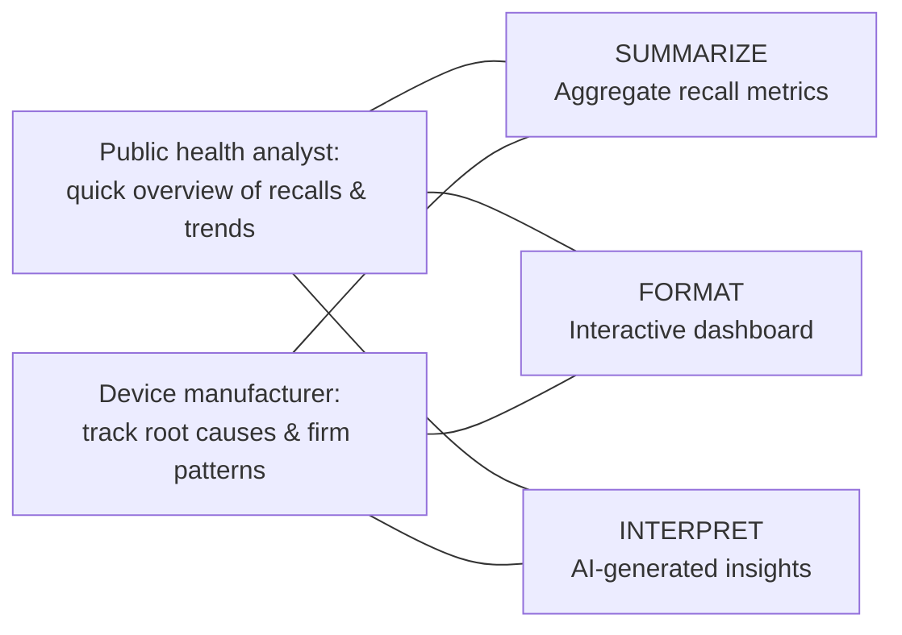

# Project Design: FDA Recall Reporter

## Tool Name

**FDA Recall Reporter** — an AI-powered dashboard that queries the FDA device recall API, displays interactive recall data in a Shiny app, and uses AI to generate plain-language summaries of recall trends.

---

## Stakeholders & Needs

| Stakeholder | Need |
|-------------|------|
| **Public health analyst** | Needs a quick overview of recent FDA device recalls and trends to assess risk across product categories |
| **Medical device manufacturer (quality team)** | Needs to track recall root causes and firm-level patterns to inform internal quality processes |

---

## System Goals

| # | Goal | Core Function |
|---|------|---------------|
| 1 | Aggregate raw recall records into key metrics (total recalls, unique firms, top root causes) | **SUMMARIZE** |
| 2 | Present data in an interactive dashboard with filterable tables, bar charts, and trend lines | **FORMAT** |
| 3 | Use AI (Ollama / OpenAI) to generate plain-language insights and recommendations from the recall data | **INTERPRET** |

---

## Stakeholder Needs → System Goals Map



---

## How It Works

```
FDA openFDA API  ──►  Shiny App (R)  ──►  AI Model (Ollama / OpenAI)
   (raw JSON)         (dashboard)          (plain-language report)
```

1. **Query** — The app calls `https://api.fda.gov/device/recall.json` with user-selected date ranges and record limits.
2. **Display** — A Shiny dashboard built with `bslib` shows summary cards, a searchable data table, a top-root-causes bar chart, and a monthly trend line.
3. **Report** — Processed data is sent to an AI model that returns a structured summary with key findings and recommendations, saved as `.txt`, `.md`, `.html`, or `.docx`.

---

## Example Input → Output

| Input | Output | Key Functions |
|-------|--------|---------------|
| FDA recall JSON (2024 records) | Interactive dashboard + AI-generated 1-page summary | SUMMARIZE, FORMAT, INTERPRET |
